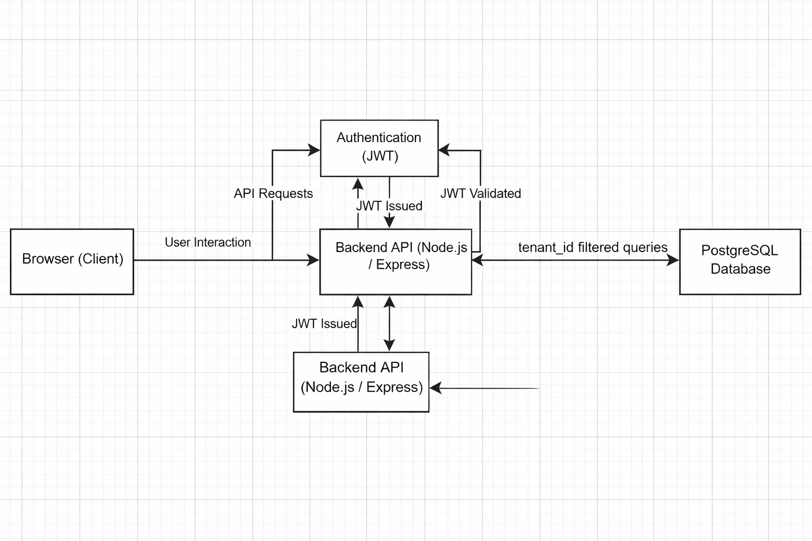
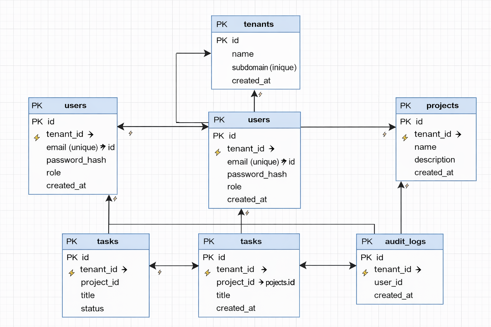

## System Architecture Diagram

This diagram illustrates the high-level architecture of the multi-tenant SaaS application. 
The client interacts with a React-based frontend, which communicates with a Node.js and Express backend API.
Authentication is handled using JWT tokens, and all data is stored in a shared PostgreSQL database.
Tenant isolation is enforced at the application level using middleware and `tenant_id` filtering.

## Database ERD

The database schema is designed using a shared database and shared schema multi-tenancy approach.
Each table includes a `tenant_id` column to enforce strict tenant-level data isolation.
Relationships between tenants, users, projects, tasks, and audit logs ensure secure and scalable data access.

## API Architecture

The backend exposes a RESTful API designed to support a multi-tenant SaaS platform.
All tenant-scoped endpoints enforce authentication and tenant isolation using JWT middleware and `tenant_id` filtering.
Role-Based Access Control (RBAC) is applied to restrict access based on user roles.

### Authentication APIs
| Method | Endpoint | Auth Required | Role |
|------|---------|---------------|------|
| POST | /api/auth/register | No | Public |
| POST | /api/auth/login | No | Public |
| GET  | /api/auth/me | Yes | All |

### Tenant Management APIs
| Method | Endpoint | Auth Required | Role |
|------|---------|---------------|------|
| GET  | /api/tenants | Yes | Super Admin |
| GET  | /api/tenants/:id | Yes | Super Admin |
| PUT  | /api/tenants/:id | Yes | Super Admin |

### User Management APIs
| Method | Endpoint | Auth Required | Role |
|------|---------|---------------|------|
| GET  | /api/users | Yes | Tenant Admin |
| POST | /api/users | Yes | Tenant Admin |
| PUT  | /api/users/:id | Yes | Tenant Admin |
| DELETE | /api/users/:id | Yes | Tenant Admin |

### Project Management APIs
| Method | Endpoint | Auth Required | Role |
|------|---------|---------------|------|
| GET  | /api/projects | Yes | All |
| POST | /api/projects | Yes | Tenant Admin |
| GET  | /api/projects/:id | Yes | All |
| PUT  | /api/projects/:id | Yes | Tenant Admin |
| DELETE | /api/projects/:id | Yes | Tenant Admin |

### Task Management APIs
| Method | Endpoint | Auth Required | Role |
|------|---------|---------------|------|
| GET  | /api/projects/:id/tasks | Yes | All |
| POST | /api/projects/:id/tasks | Yes | Tenant Admin |
| PUT  | /api/tasks/:id | Yes | All |
| DELETE | /api/tasks/:id | Yes | Tenant Admin |
